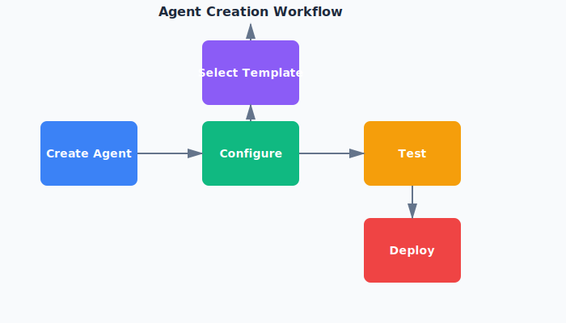

# Erste Schritte mit KI-Agenten

Willkommen bei JoAi! Dieser Artikel hilft Ihnen dabei, Ihren ersten KI-Agenten zu erstellen und die Grundlagen ihrer Funktionsweise zu verstehen.

## Was Sie lernen werden

- Wie Sie Ihren ersten KI-Agenten erstellen
- Grundlegende Konfigurationsoptionen
- Best Practices für die Agenten-Einrichtung
- Häufige Anwendungsfälle und Beispiele

## Erstellen Sie Ihren ersten Agenten

Um einen neuen KI-Agenten zu erstellen, navigieren Sie zum Bereich "Agenten" in Ihrem JoAi-Dashboard. Klicken Sie auf die Schaltfläche "Neuen Agenten erstellen" und folgen Sie diesen Schritten:

1. **Benennen Sie Ihren Agenten** - Wählen Sie einen beschreibenden Namen, der seinen Zweck widerspiegelt
2. **Wählen Sie eine Vorlage** - Beginnen Sie mit einer vorkonfigurierten Vorlage oder erstellen Sie von Grund auf neu
3. **Konfigurieren Sie Fähigkeiten** - Definieren Sie, was Ihr Agent tun kann
4. **Festlegen von Berechtigungen** - Kontrollieren Sie, auf welche Ressourcen Ihr Agent zugreifen kann

## Grundlegende Konfiguration

Jeder KI-Agent erfordert eine grundlegende Konfiguration:

- **Zweck**: Definieren Sie, welche Aufgabe Ihr Agent ausführen soll
- **Auslöser**: Richten Sie ein, wann und wie Ihr Agent aktiviert werden soll
- **Aktionen**: Geben Sie an, welche Aktionen Ihr Agent ausführen kann
- **Grenzen**: Setzen Sie Grenzen, um einen sicheren Betrieb zu gewährleisten

## Best Practices

Beachten Sie beim Einrichten Ihrer KI-Agenten diese Tipps:

- Beginnen Sie einfach und fügen Sie schrittweise Komplexität hinzu
- Testen Sie Ihren Agenten zuerst in einer sicheren Umgebung
- Setzen Sie klare Grenzen und Berechtigungen
- Überwachen Sie die Leistung Ihres Agenten regelmäßig
- Dokumentieren Sie den Zweck und die Konfiguration Ihres Agenten

## Häufige Anwendungsfälle

KI-Agenten können für verschiedene Aufgaben verwendet werden:

- **Kundensupport**: Automatisches Beantworten häufiger Fragen
- **Datenverarbeitung**: Extrahieren und Organisieren von Informationen aus Dokumenten
- **Aufgabenautomatisierung**: Bearbeitung wiederkehrender Workflows
- **Content-Generierung**: Automatisches Erstellen und Formatieren von Inhalten

## Fazit

Sie sind jetzt bereit, Ihren ersten KI-Agenten zu erstellen! Beginnen Sie mit einem einfachen Anwendungsfall und erkunden Sie schrittweise erweiterte Funktionen. Weitere detaillierte Informationen finden Sie in unseren anderen Artikeln zu spezifischen Agententypen und erweiterten Konfigurationen.
